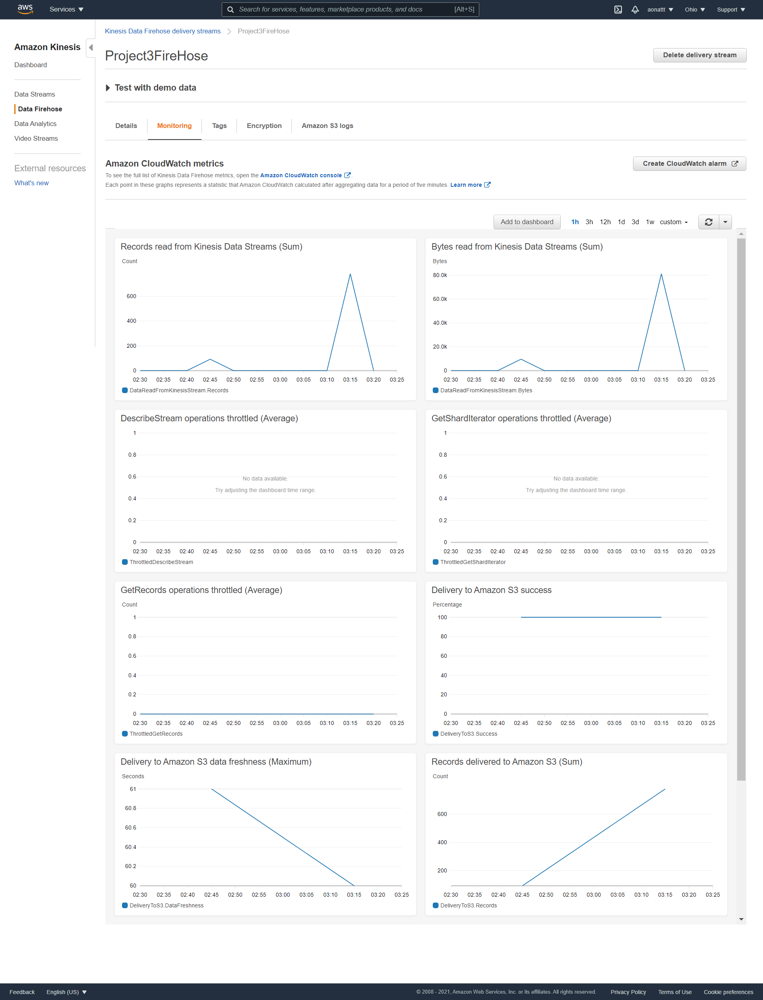

# Streaming Finance Data with AWS Lambda

This project is to create an environment where flowing stock prices are stored and analyzed simultaneously in real time by applying queries on the stored data, generating visuals.

## Technologies Used

Services Used: AWS Kinesis, Lambda, S3, Glue, Athena
Library Used: yfinance
Other Web Application Used: Jupyter Notebook (for visualization)

To conduct this project; 

*1.Create and configure a Kinesis Stream on AWS.*
*2.Write a Lambda function to gather data through Yahoo Finance API and place it into an S3 Bucket.*
*3.Configure and use AWS Glue to transform the data stored in the S3 bucket.*
*4.Apply interactive queries by using AWS Athena.*
*5.Download a csv file as output and create visuals through Jupyter Notebook by using the csv file.*

## Kinesis Configuration

